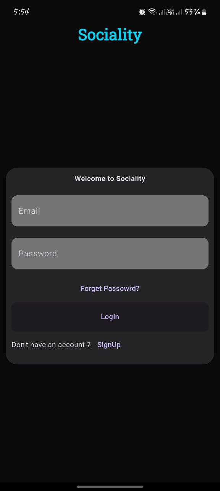
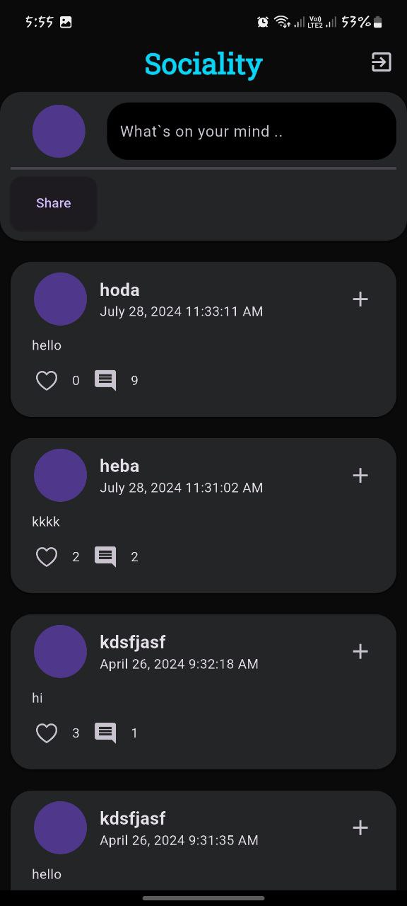
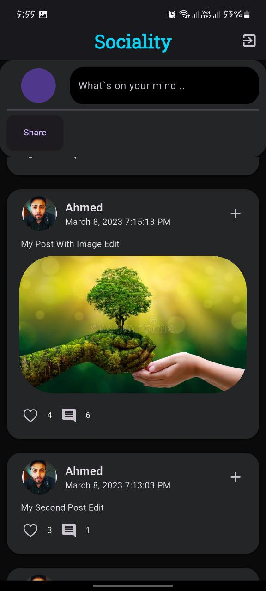

# 🌐 Sociality

A modern social media mobile app built with **Flutter** and **GetX**, allowing users to share posts, interact with others, and explore trending content — all in a smooth, responsive interface.

## 📱 Features

- User Authentication (Login / Signup)
- Upload and View Posts
- Like & Comment on Posts
- Real-time Feed Updates
- User Profiles

## 🚀 Tech Stack

- Flutter 💙
- GetX for State Management ⚡
- Rest Api
- Responsive UI Design

---

## 📷 Screenshots

| Home Feed | Create Post | Profile |
|----------|-------------|---------|
|  |  |  |

---

## 📥 Download APK

Install the app on Android:  
📱 **[Download APK](https://drive.google.com/file/d/1cMygwzEx_qCVsgnK8CqsfyUAQeoQ63Z-/view?usp=drive_link)**

---
